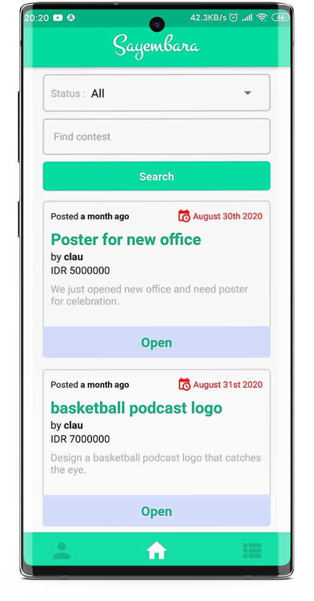
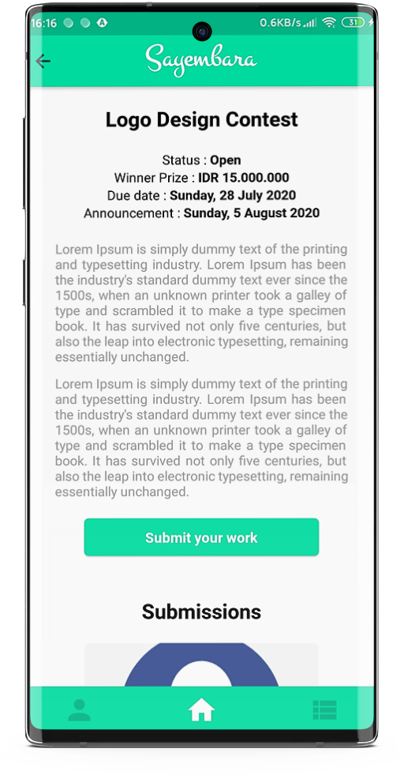
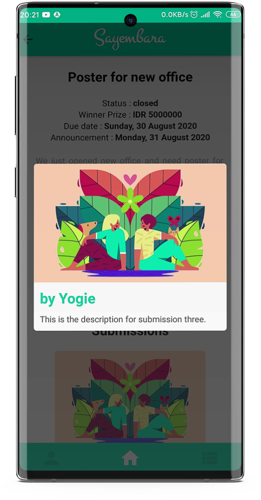
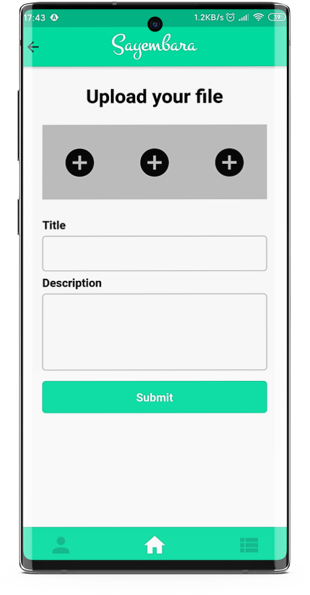
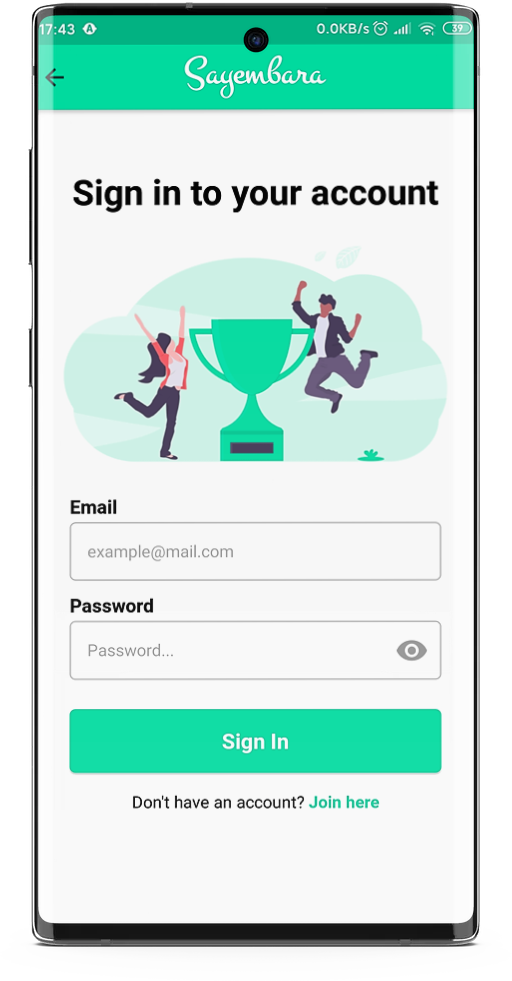

# Sayembara Project

## Description
Sayembara is a platform for peopl­­­e to making contest or searching for contest and submitting their work to winning the prize of the contest. This application is designed for participants, so users can view contests and participate through the mobile platform.

## Features
* Searching and view contests
* View submissions of contest
* Register and Login as participant
* Participate and submitting a work to some contest (Login Required)

## How to run
* Clone this project.
* At root directory run `npm install` to install the dependencies.
##### Android
* Run `react-native run-android` to run on Android devices
##### iOS
* Run `cd ios/ && pod install`.
* Then run `react-native run-ios` to run the project on iOS devices or run through Xcode.

## Technology
* Regularly update the library to the latest version.
* Routing with React Navigation (BottomTabNavigator, StackNavigator).
* Apply flow with Redux pattern.

## Showcase
      